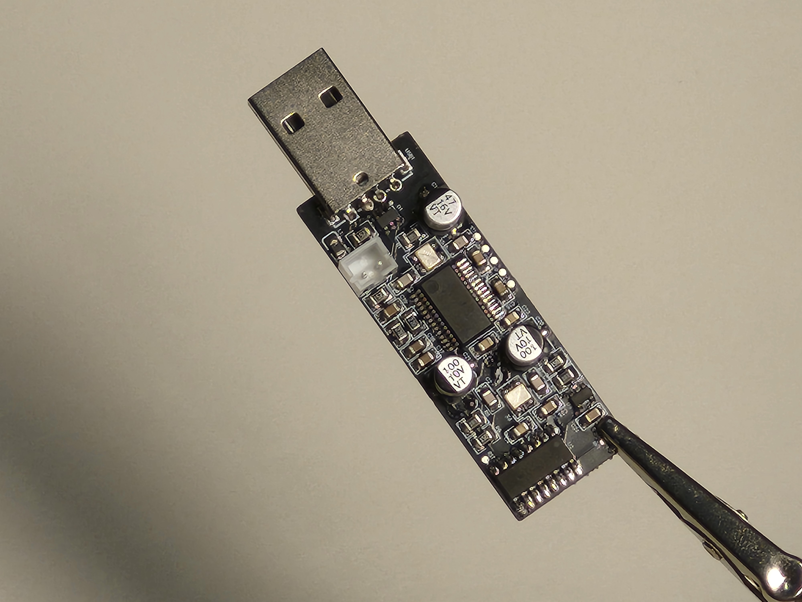
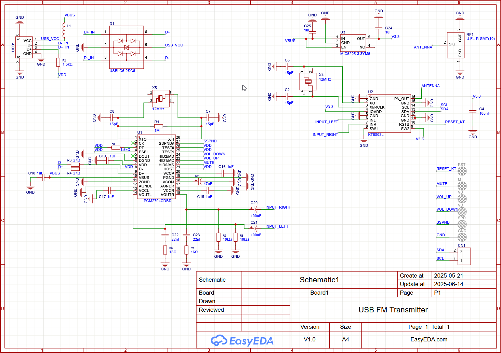
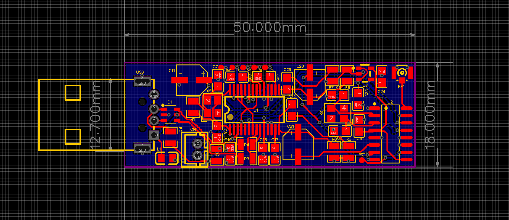
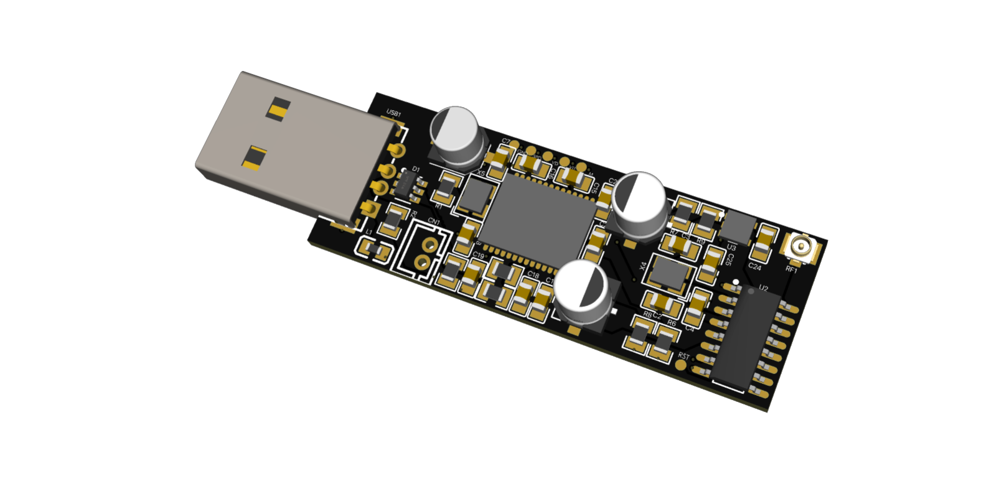
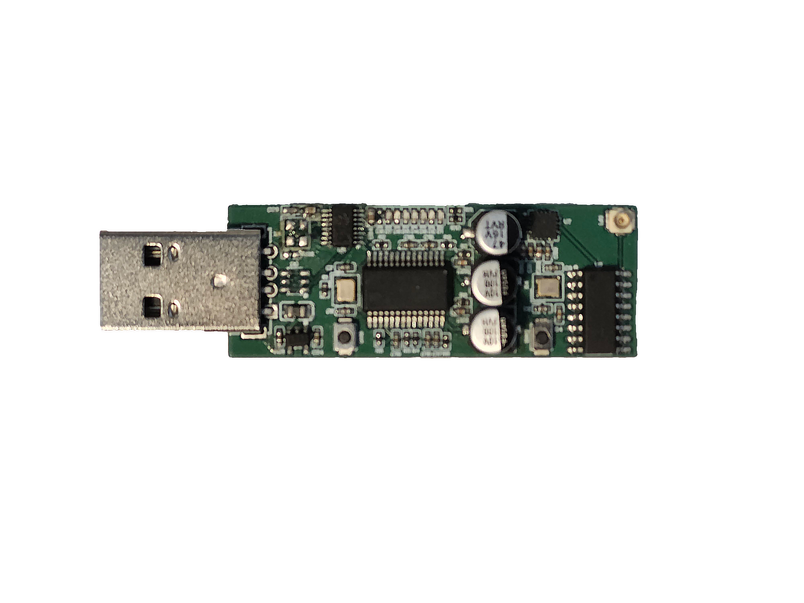
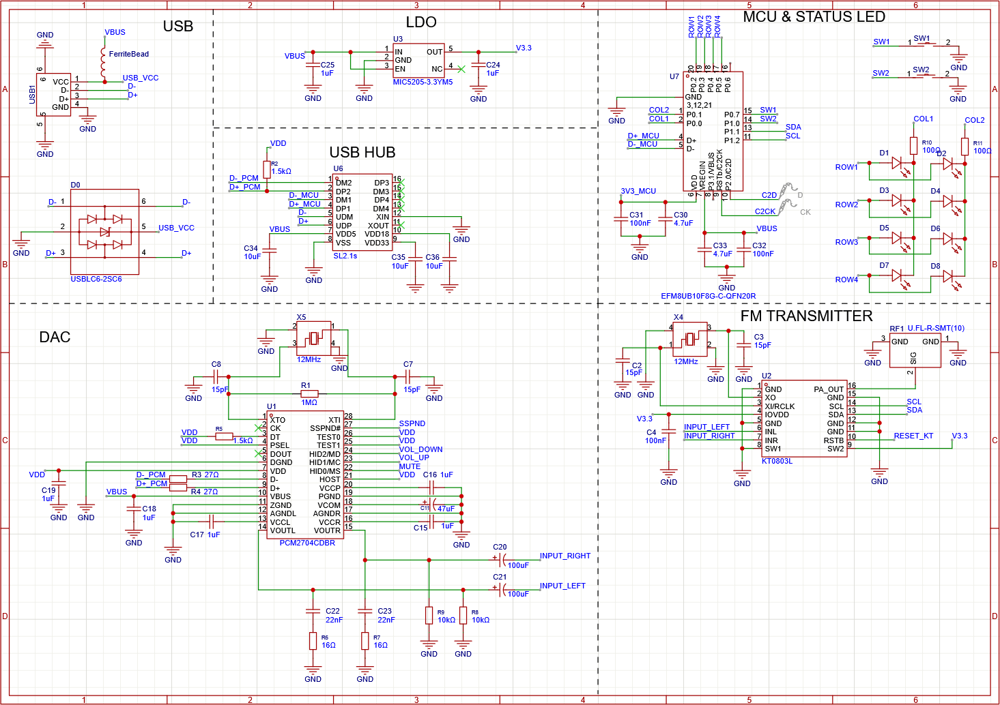
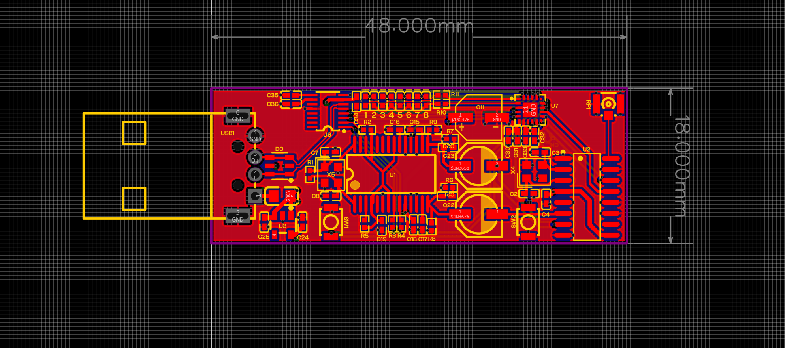
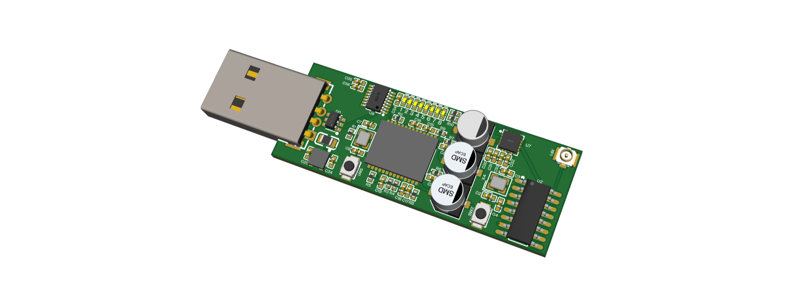

# USB FM Transmitter

This project is a compact USB controlled FM transmitter module designed to stream and transmit audio directly from your computer to a FM band. This is a plug and play module and will work without installing any drivers or running any custom commands. Just simply plug it into your PC and start transmitting audio. This project uses the PCM2704 to receive audio from the host device and sends it off to the KT0803L chip to transmit over FM band. There are test pads on the board for the PCM2704 chips HID controls such as Mute, Volume Up/Down and Suspend. There is also a connector on board for communicating over I2C with the KT0803L. You can use I2C to change KT0803L's Transmitting Frequency, calibration parameters, operation statues, mode and power controller. 

## V1 Demo

https://github.com/user-attachments/assets/b6735c28-1eea-4149-aa80-006a72d71160

## Code
Even though this board is plug and play, you can still program it over I2C to change settings on the KT0803 chip.
The code in `src/code.py` lets you change the output frequency of the chip. To run that code you must first connected the sda and scl pins on the board to any microcontroller that supports micro/circuitpython and that they both are connected to the same device (share the same ground). there is no need to add external pull up resistors as the KT0803 chip already has them inbuilt.

## V1

### Schematic

### PCB

### 3D 

# V2!!

Version 2 of this board includes an onboard USB hub and MCU that way you no longer need to use an external devboard to change frequencies. It also has two onboard buttons and led to change and display the frequency!!

	V2 has been assembled and tested. Although I have not yet had the chance to write firmware for the Silicon Labs Chip. If you want to make your own I would recommend using a different MCU (like an STM32) as its easier to bringup.

### Schematic

### PCB

### 3D

## BOM 

	For V2

| Component                                                                                                                                                                                                                                                                                                                                                                                                                                                                                                                                                                                                                  | Quantity | Price                     |
| -------------------------------------------------------------------------------------------------------------------------------------------------------------------------------------------------------------------------------------------------------------------------------------------------------------------------------------------------------------------------------------------------------------------------------------------------------------------------------------------------------------------------------------------------------------------------------------------------------------------------- | -------- | ------------------------- |
| PCB+Stencil                                                                                                                                                                                                                                                                                                                                                                                                                                                                                                                                                                                                                | MOQ      | $17.88                    |
| [Componenets](./src/V2/production/BOM.csv)(lcsc)                                                                                                                                                                                                                                                                                                                                                                                                                                                                                                                                                                                                         | -        | $34.05 ($21+$12 Shipping) |
| [EFM8UB10F8G-C-QFN20R Digikey](https://www.digikey.ca/en/products/detail/silicon-labs/EFM8UB10F8G-C-QFN20/5592436) Out of stock at lcsc                                                                                                                                                                                                                                                                                                                                                                                                                                                                                    | 2        | $13.29 ($8 Shipping)      |
| [Oscilloscope Probe](https://www.aliexpress.com/item/1005003950007418.html?spm=a2g0o.productlist.main.4.639a338bvSREdx&aem_p4p_detail=202507241340009223983585517000000536948&algo_pvid=23d05d68-36a2-471b-8f67-f0e0668d1140&algo_exp_id=23d05d68-36a2-471b-8f67-f0e0668d1140-3&pdp_ext_f=%7B%22order%22%3A%221996%22%2C%22eval%22%3A%221%22%7D&pdp_npi=4%40dis%21CAD%216.99%216.99%21%21%215.02%215.02%21%402103010b17533896004516670e8102%2112000027542547180%21sea%21CA%216156843420%21X&curPageLogUid=WEZGzP0MYw3k&utparam-url=scene%3Asearch%7Cquery_from%3A&search_p4p_id=202507241340009223983585517000000536948_1) | 1        | $7                        |
| [Test Hooks](https://www.aliexpress.com/item/1005009494803550.html?spm=a2g0o.productlist.main.2.48f97e11sIoaph&algo_pvid=f9c78f9e-ec6d-4521-aca7-5f0eee672565&algo_exp_id=f9c78f9e-ec6d-4521-aca7-5f0eee672565-1&pdp_ext_f=%7B%22order%22%3A%221%22%2C%22eval%22%3A%221%22%7D&pdp_npi=4%40dis%21CAD%216.50%214.43%21%21%2133.41%2122.78%21%402101c59517533896775841663e44d1%2112000049278458209%21sea%21CA%216156843420%21X&curPageLogUid=04EvxQGF88uW&utparam-url=scene%3Asearch%7Cquery_from%3A)                                                                                                                         | 1 set    | $5                        |
| **Total**                                                                                                                                                                                                                                                                                                                                                                                                                                                                                                                                                                                                                  |          | $76                       |
